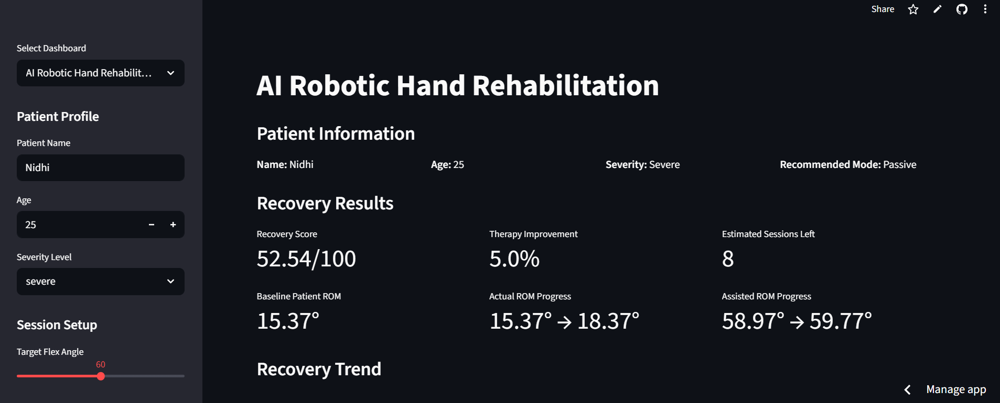
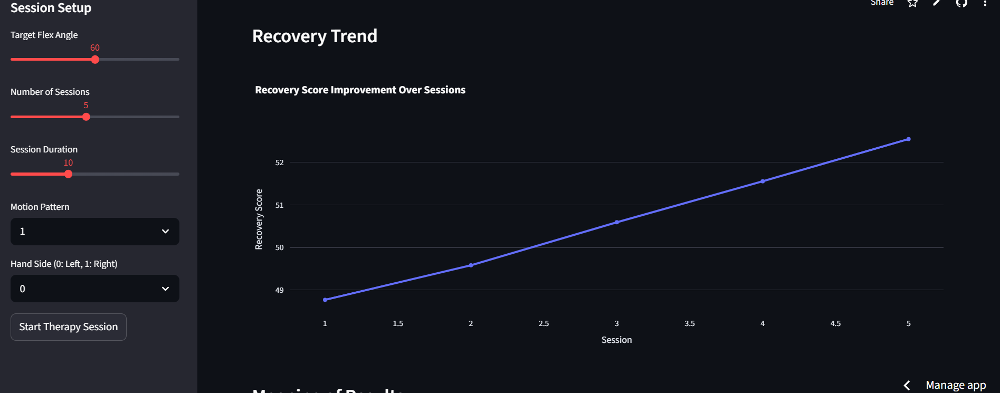
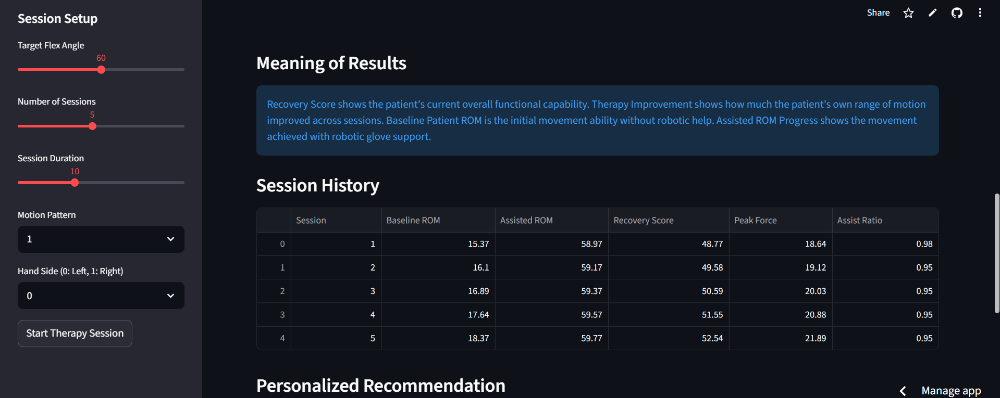
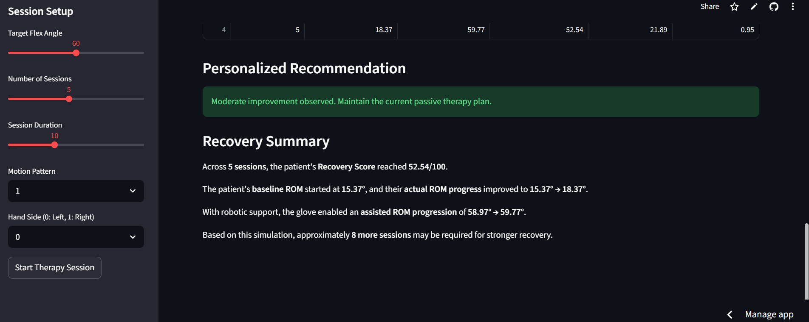
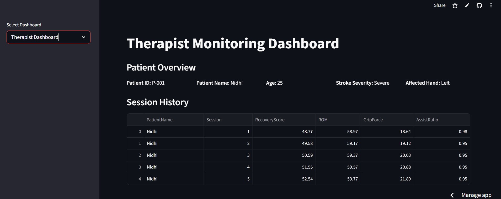
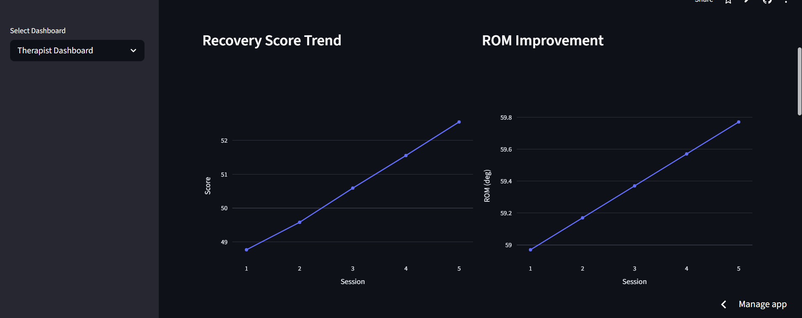
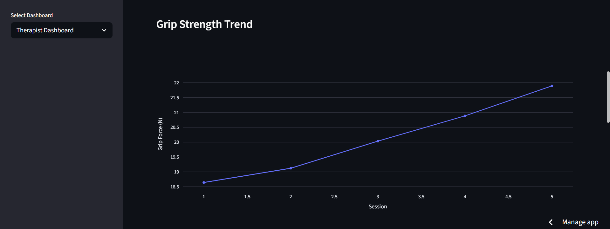
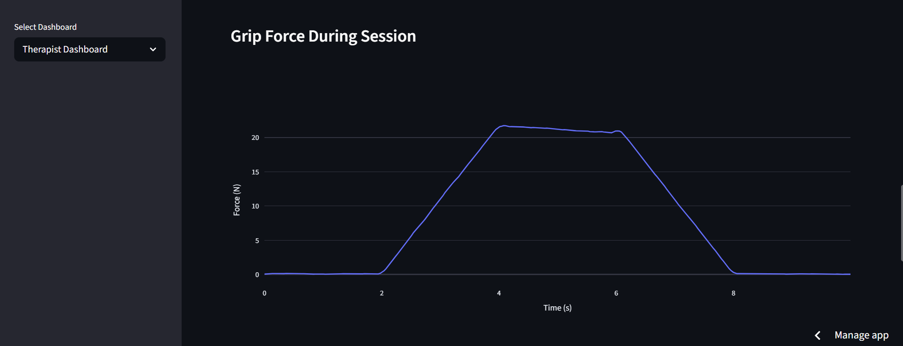
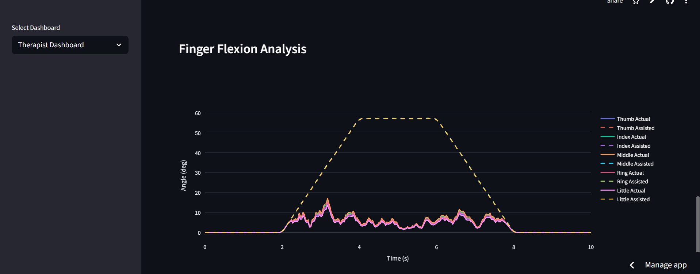

# AI Robotic Hand Rehabilitation System

An AI-assisted rehabilitation dashboard designed to simulate robotic hand therapy, patient recovery tracking, and therapist monitoring for stroke rehabilitation support.

## Features

* AI-assisted rehabilitation monitoring
* Patient recovery analytics
* Therapist monitoring dashboard
* Grip strength analysis
* Finger flexion tracking
* ROM (Range of Motion) improvement visualization
* Session history and recovery trends
* Personalized rehabilitation recommendations
* Interactive Streamlit-based dashboard

## Technologies Used

* Python
* Streamlit
* Pandas
* Plotly
* CSV-based data handling

## Applications

* Stroke rehabilitation support
* Smart healthcare systems
* Robotic hand therapy simulation
* AI-assisted physiotherapy monitoring

## Project Preview

### Main Rehabilitation Dashboard

### Recovery Trend Analysis

### Session History

### Personalized Recommendation System

### Therapist Monitoring Dashboard

### ROM Improvement Analysis

### Grip Strength Trend

### Grip Force During Session

### Finger Flexion Analysis

## Future Enhancements

* Real-time IoT sensor integration
* Robotic glove hardware connectivity
* Machine learning-based recovery prediction
* Cloud database integration
* Real patient rehabilitation tracking
